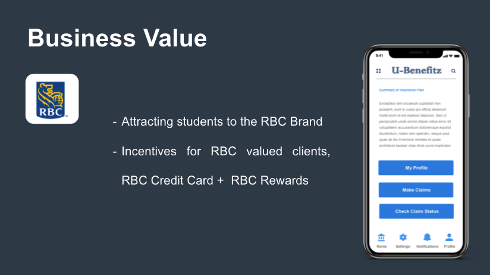
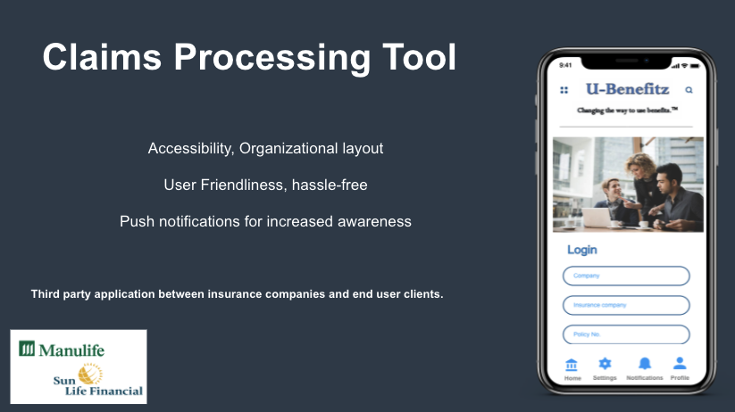

# Ubenefitz - Claims Processing (RBC Amphacks 2019)
This is a web Application Proof-of-Concept which demonstrates health based claims processing for university students. Specifically, web-scraping is used to scrape data from University websites using React, JS and the information is used to provide insights and recommendation to every user profile.

# Technology Stack
- Web Framework: React JS
- Software: Javascript, HTML, CSS

# Depictions

# Business Justification

